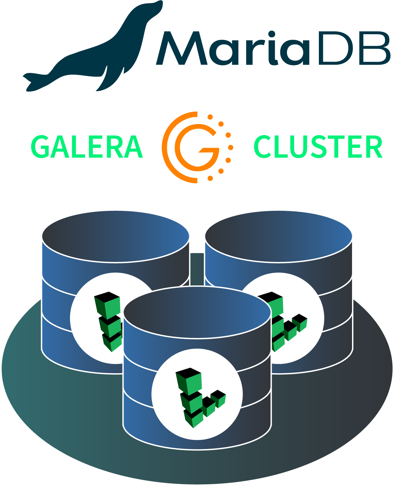

# Marketplace Galera Cluster with MariaDB 
Deploy a three node, MariaDB Galera cluster from the Linode Marketplace. Galera provides a performant multi-master/active-active database solution with synchronous replication, to achieve high availability.

Supported distributions:
- Ubuntu 20.04
- Debian 10 

MariaDB version:
 - 10.3

## Documentation
Deployment guide:
- [Deploying MariaDB Galera Cluster through the Linode Marketplace]()
 

Additonal resources:
- [Galera Cluster](https://galeracluster.com/products/)
- [What is MariaDB Galera Cluster?](https://mariadb.com/kb/en/what-is-mariadb-galera-cluster/)

## Contributing
Contributions are welcome! Please generally adhere to the [sample directory layout](https://docs.ansible.com/ansible/latest/user_guide/sample_setup.html#sample-ansible-setup) and best practices/recommondations from the latest Ansible [User Guide](https://docs.ansible.com/ansible/latest/user_guide/index.html).

Please read the [developement guidelines](docs/DEVELOPMENT.md) for help with setting up a development environment and the [contributing guidelines](docs/CONTRIBUTING.md) for help creating your first Pull Request.

## Reaching Out
To report a bug or request a feature, please open a GitHub Issue. For general feedback, use feedback@linode.com.
